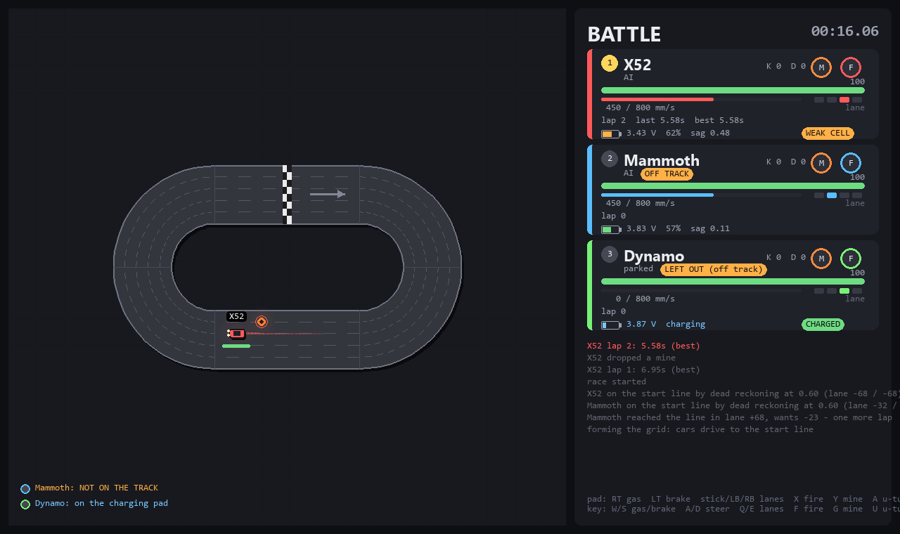
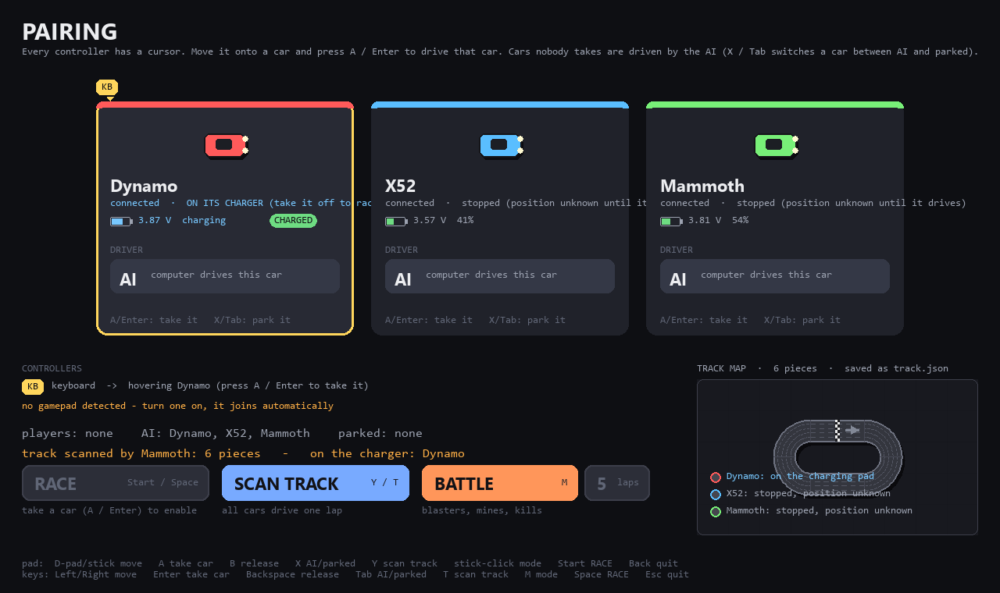
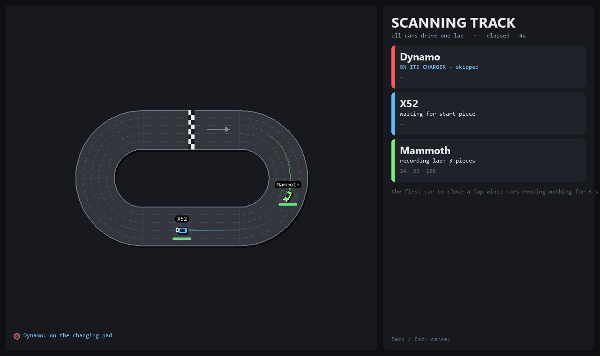
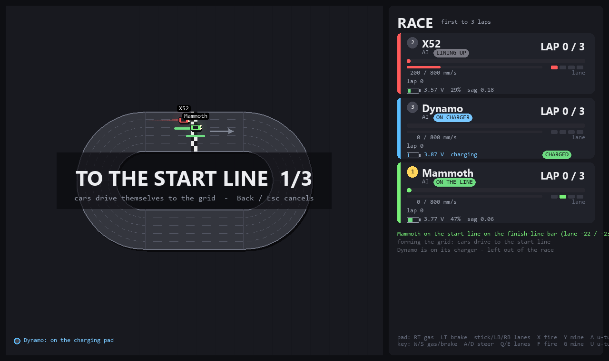
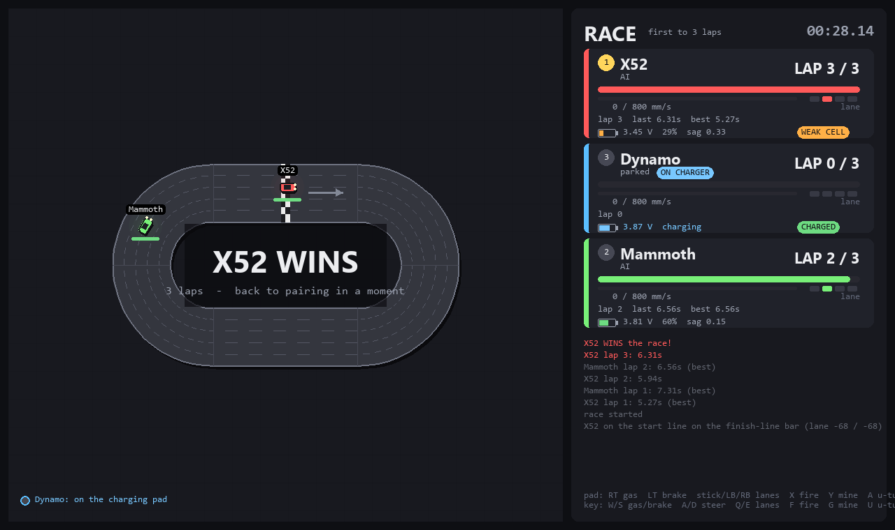

# Overdrive Arena

Drive [Anki Overdrive](https://en.wikipedia.org/wiki/Anki_(company)) cars from a Windows PC with Xbox / PS5
controllers or the keyboard, watch them live on a map scanned from your own track, and race or battle with
virtual weapons. Pure Python: `bleak` for Bluetooth LE, `pygame` for input and rendering.

The cars are long out of production and the official app is gone from the stores. This project talks to the
cars directly, with the protocol verified on real hardware (firmware 11866) and documented below.



| Pairing | Track scan |
|---|---|
|  |  |

| Starting grid | Race finish |
|---|---|
|  |  |

## Features

- **Controllers**: any gamepad SDL recognises (Xbox, DualSense, Switch Pro...) plus the keyboard, one per car.
  Pads can join or leave while the app runs.
- **Track scanning**: the cars drive one lap and the loop is rebuilt from the track codes (piece ids, curve
  direction from wheel travel, closure check). Saved as `track.json`.
- **Live map**: a circuit-constrained Kalman position estimate combines measured speed, lane radius and
  BLE position fixes. Prediction crosses piece boundaries and stops after one second without a fix.
- **Map records**: best lap and fastest completed race saved in `records.json` and shown on the main
  screen in ranked car and controller tables. Personal records are saved even when they do not beat the
  overall map record. Human and AI records, modes, and race lengths are kept separate; car/controller
  combinations are also retained. Cars use their Bluetooth address. Controller records use model plus
  player slot (P1/P2/P3), since identical pads do not expose a unique identity through pygame. Keep the
  same connection order for consistent slots. Existing overall records are retained; historical personal
  times that were never saved cannot be reconstructed. Long tables rotate pages every seven seconds.
- **Starting grid**: every car drives itself to the start line in its own lane and stops on the finish-line
  bar; 3-2-1-GO releases them together.
- **Two modes**: BATTLE (blasters, mines, HP, kills) or RACE (laps only, first to N laps wins).
- **AI drivers** with per-car Easy, Normal, Hard, and Extreme levels, including AI-only races. They brake before curves and accelerate on straights.
- **Battery and charger tracking**: voltage, estimated %, sag under load (finds tired cells), CHARGING /
  CHARGED when a car sits on its pad, CSV history.
- **Robust links**: automatic reconnection when a car reboots, gentle default acceleration for old batteries.

## Setup

Windows 10/11 with a Bluetooth LE adapter, Python 3.11+.

```bash
git clone https://github.com/Leicas/overdrive-arena.git
cd overdrive-arena
python -m venv .venv
.venv\Scripts\python -m pip install -r requirements.txt
.venv\Scripts\python app.py
```

Cars must be powered on. Turn controllers on before starting (or later, they hot-plug).
Gamepads continue working when the window loses focus; keyboard controls require focus.
Controllers pulse on **3, 2, 1**, with a stronger pulse at **GO**.

## How to play

1. **Connect**: every advertising car is connected (limit with `--max-cars N` or `--car <address>`).
2. **Pairing screen**: one card per car with a **driver slot** that reads either a player badge (P1, P2, KB),
   **AI** or **PARKED**. Every controller and the keyboard has its own cursor badge floating above the cards.
   - Move the cursor: D-pad / left stick (keyboard: Left/Right). The car under a cursor blinks its headlights.
   - **A** (Enter): take the car you are hovering. Press again, or **B** (Backspace), to release it.
   - **X** (Tab): cycle an unclaimed car through Easy / Normal / Hard / Extreme / Parked (default: Normal).
   - **SCAN TRACK** (Y / T / click): every connected car drives a lap; the first to close the loop provides the
     map. Cars that read no track code within 8 s are flagged "NOT ON THE TRACK". Do this once per layout.
   - **BATTLE / RACE** (M / left-stick click / click) picks the mode; **D-pad up/down** or the **laps** button selects 3 / 5 / 10 / 20 laps.
   - **RACE** (Start / Options / Space / click): enabled with at least one connected player or AI car off its charger. Leave all cars unclaimed for an AI-only race. The controllers legend and
     the "players / AI / parked" line tell you who drives what.
3. **Starting grid**: each participant drives to the start line in its own lane (turning around first if it
   faces the wrong way), crawls the last half piece at 200 mm/s and stops on the finish-line bar. Cars that
   overshoot the line or arrive in the wrong lane do a full lap before trying again; after three failed
   attempts they stop and are left out. Cars that read no codes within 12 s, or sit on their charger,
   are left out. Then **3-2-1-GO**.
4. **Race**. **Back** (Esc) stops everything and returns to pairing. **F11** toggles fullscreen.
   After a finish, **Start / Options** starts another grid and countdown with the same selections.
   Replace an off-track car, then press **right-stick / R3 / R**, or click **RECOVER**. The controller
   retries its player's car plus waiting AI; the on-screen button retries all waiting cars. Each search
   is limited to 1.5 seconds at up to 250 mm/s. Brake or emergency stop cancels a player's search.

BLE notifications are timestamped on arrival, before parsing or queueing. Position fixes are applied at
that time and projected to the current frame; older out-of-order motion updates are ignored. Delayed
forward corrections hold the displayed car briefly instead of animating it backwards. The firmware's
position packet has no device timestamp, so this compensates app queue delays, not radio transit time.

The map and lap counter share one continuous, unwrapped route estimate. Every update and frame prediction
is kept in timestamp order, so a forward circuit shown by the estimate completes a lap even if the finish
codes were missed or several updates arrived between frames. Crossing times are interpolated along the
track geometry. BLE corrections cannot subtract distance already displayed or count a finish twice.
Prediction freezes after one second without a fix; silence holds progress instead of erasing it or
inventing more laps. Reversal, explicit off-track reports and recovery reset the partial lap. The HUD
shows current-lap progress and reset reasons. A complete forward circuit is required for a timed lap.

| Action              | Xbox            | PS5           | Keyboard          |
|---------------------|-----------------|---------------|-------------------|
| Throttle / brake    | RT / LT         | R2 / L2       | W / S             |
| Steer (analog)      | Left stick X    | Left stick X  | A / D             |
| Snap lane           | LB / RB, D-pad  | L1 / R1       | Q / E             |
| Fire blaster        | X               | Square        | F                 |
| Drop mine           | Y               | Triangle      | G                 |
| U-turn              | A               | Cross         | U                 |
| Straight boost      | Left stick click | L3           | Left Shift        |
| Retry recovery      | Right stick click | R3          | R                 |
| Emergency stop      | B               | Circle        | Space             |
| Speed limit +/- 100 | D-pad up/down   | D-pad up/down | + / -             |
| Back / quit         | View            | Share         | Esc               |

### Speed and boost

Player throttle uses a separate **2000 mm/s command limit** by default. Full RT/R2 (or full keyboard
throttle) requests that speed; D-pad up/down or +/- changes the player's limit by 100 mm/s. The limit
is retained when you release/reclaim a car and does not raise its AI limit. Actual motor speed may be
lower. `--player-max-speed` sets a lower initial limit; `--max-speed` sets the AI limit.

**Left-stick click / Left Shift** requests a 0.6-second straight boost, with a 6-second cooldown.
Hard and Extreme AI use it automatically when possible. The boost ceiling is 150% of the normal limit,
capped at 1500 mm/s, and braking-distance checks may lower the target. Boost does not raise curve or
learned corner limits and cancels for curves, stale position data, recovery, lane changes, or nearby
traffic. A player already using the full 2000 command range needs no boost.

### Battle weapons

- **Blaster** (1 s cooldown): hits the nearest car ahead within 1.4 m along the track, any lane.
  20 damage, victim slowed to 45 % for 1.5 s.
- **Mine** (4 s cooldown, 2 active): dropped in your lane, arms after 1 s, lives 45 s. A car passing within
  12 cm in that lane takes 35 damage and is stopped for 1.2 s.
- 100 HP. At 0 the car is destroyed: stopped 3 s with flashing lights, then respawns. Kills are counted.
- Hits flash the victim's lights and rumble its controller.

### Race mode

Weapons off. Cards show `LAP n / target` and a progress bar; ranking by laps then position. The first car to
the target gets a "X WINS" banner, the others roll to a stop, and the app returns to pairing.
`--mode race --laps 10` pre-selects.

By default, AI straight / curve targets are 64% / 52% (Easy), 80% / 68% (Normal), and
100% / 84% (Hard) of the car speed limit. Hard uses the full limit on straights with enough braking room.
An explicit `--ai-speed` overrides the Normal straight baseline; Easy uses 80% and Hard 125% of it,
always capped by the car speed limit. Actual speed depends on acceleration and available straight length. Hard AI also reacts faster with weapons in Battle.
Unknown positions use a cautious speed up to 300 mm/s. Hard brakes later for turns. In Race mode, AI checks cars ahead and behind before passing into an adjacent lane, reserves pending lane changes, and slows behind traffic when blocked. Lane changes start only on straights. The AI looks three pieces ahead and prefers the shortest clear lane through upcoming curves, moving one adjacent lane at a time. Balanced left/right turns keep the current lane to avoid needless weaving.

**Extreme** automatically uses a ceiling of **2,000 mm/s**; an explicit `--max-speed` overrides it.
It chooses the actual target from the current lane, requested lane, and braking distance to upcoming
curves, with an 80 ms braking margin. Corner speed starts from the tighter lane radius
(`v = sqrt(3200 * radius_mm)`). Short straights may never allow the full ceiling before braking.
This is a tunable driving model, not a measured grip guarantee for every car and track.

AI learns a corner-speed limit separately for each car. A spin or confirmed off-track event near a
curve lowers that limit by 15% (minimum 200 mm/s); retries during the same recovery do not lower it
again. Extreme scales this learned limit with curve radius: tighter lanes need lower speeds, while
wider curves can be faster. The lower corner limit also brings braking forward on the approach.
After three fully observed clean turns at at least 90% of the learned limit, AI probes 2% faster,
bounded by the difficulty's normal limit and, for Extreme, the geometry estimate. Slow traffic does
not earn a speed increase. The HUD shows the learned reference turn limit and the event feed reports
adjustments. Learning stays in memory across races; restarting the app or loading/scanning a track
resets it.

A reversal invalidates the current lap. The next forward finish-line crossing starts a fresh timed
lap; it earns no point. A complete forward circuit is required to score again, so U-turns, finish-line
oscillation, and lost localization cannot create a shortcut lap. Already completed laps are retained.

### Off-track AI recovery

An explicit off-track report stops that AI immediately. If track messages go stale instead,
it tries reading the track at 250 mm/s for at most 1.5 seconds, then stops. There are no endless retries.
Put a stopped car back on the track and press **R** (or click the right stick) to give waiting AI cars
one short detection attempt. Fresh track codes resume driving automatically; wrong-way recovery still
applies. Cars on chargers or with lost connections do not search. Recovery invalidates the current lap.
Leaving a curve and reporting off-track also lowers the learned corner limit once per incident, including a report that arrives after a search has begun or between rendered frames. Missing telemetry alone does not count as a cornering failure.

### What the screen shows

- **Map**: car sprites with trails, hit rings, explosions, floating damage; mines pulse once armed; cars that
  are off the track, on a charger or have lost their link are listed in the map corner.
- **Cards**: rank badge, driver, status chip (LINING UP / ON THE LINE / SLOWED / STUNNED / DESTROYED /
  WRONG WAY / OFF TRACK / ON CHARGER), HP or lap progress, speed bar and limit, lane indicator, weapon dials,
  laps with last and best time, battery row.
- **Kill feed** in player colours, race clock.

### Position and Bluetooth diagnostics

The speed row shows **P** (age of the latest usable position/transition update) and **BT** (age of
any received car notification). During motion, a fresh BT age with an old P age points toward missing
track readings/localization; both old means no notifications have arrived recently, but does not by
itself prove radio interference. Stationary cars naturally report fewer track codes.
`-v` also logs notification-to-game processing delay as `queue_delay`.

Bluetooth callbacks enqueue messages; the game thread applies localization, battery logging, and
scanner updates in order using the original reception timestamps. This keeps disk I/O out of the BLE
loop and prevents rendering/driving from seeing half-applied positions. Startup connects cars serially.
Unknown track locations no longer masquerade as fresh position fixes; a forward/backward code wrap
between identical adjacent pieces can repair a missed transition.

The map interpolates between discrete printed track codes; it is not a continuous physical-position
sensor. These changes improve software handling, but do not establish that every gap is software-caused.
For comparison tests, use charged cars and wired controllers, and compare one car with three on the same
track. Earlier hardware trials showed weaker links with Bluetooth controllers sharing the adapter and
battery voltage sag under acceleration.

### Battery and charger

The car reports its single-cell LiPo voltage (polled every 4 s) and a status word with on-track / on-charger /
battery-low / battery-charged flags. The app shows voltage, an estimated percentage from a resting-voltage
curve, and the **sag** between idle and under-load voltage: above 0.20 V the cell is tired (`WEAK CELL`) and
that car is the one most likely to reboot under hard acceleration. `LOW` below 3.68 V idle, `CRITICAL` below
3.55 V. On the pad: `CHARGING`, then `CHARGED`. Every reading goes to `battery_log.csv`.

## Options

```
--max-speed N     AI speed ceiling mm/s (default 800; Extreme 2000)
--player-max-speed N  controller/keyboard limit 200..2000 mm/s (default 2000)
--accel N         acceleration mm/s^2 (default 600; harder launches reboot cars with weak batteries)
--ai-speed N      optional Normal straight baseline (default scales with car limit)      --no-ai   unclaimed cars stay parked
--ai-difficulty easy|normal|hard|extreme (default normal)
--mode battle|race   --laps N                          --keyboard-only
--max-cars N   --car ADDRESS (repeatable)   --scan SECONDS
```

## Tips

- **Bluetooth**: the cars share the PC adapter with wireless pads. With two Xbox pads on Bluetooth the car
  links got noticeably flakier; put the pads on USB / the Xbox dongle, or give the cars their own BLE dongle.
- **Weak batteries**: keep `--accel` low. A car that reboots shows LINK LOST and is reconnected automatically.
- **Lanes**: the car only knows the lateral offset the host tells it, so the app syncs it from the track codes
  before every lane command and re-tries sticky lane goals. Track codes are missed below ~250 mm/s.

## Repository layout

```
app.py              state machine: connect -> pairing -> scan -> grid -> countdown -> race
anki/protocol.py    message encoders / decoders (verified byte layouts)
anki/vehicle.py     one car over BLE: discover, connect, reconnect, notifications
anki/ble_worker.py  BLE on its own thread (pygame's COM apartment breaks bleak on the main thread)
anki/track.py       piece tables, track scanner, layout, per-car localizer
anki/data/          offsetInfo.json: location id -> lane / progress table
game/inputs.py      gamepads and keyboard -> abstract actions
game/game.py        driving, AI, grid, weapons, laps, damage
game/battery.py     battery monitor
game/render.py      map, HUD, screens
tools/              small CLI scripts used while reverse-engineering (scan, drive, lane, lights, lap logs)
tests/              AI, grid, learning, telemetry tests + recorded lap replay and render scripts
```

## Development checks

Run the offline regression suite without connecting cars:

```powershell
.venv\Scripts\python -m unittest discover -s tests -p "test_*.py"
.venv\Scripts\python tests/render_demo.py
```

Tests cover AI speed planning, traffic, boost, grid retries, lap validation, learning, recovery,
and telemetry handling. Render demos generate local preview images. Hardware speed and grip still
need verification on the actual cars and layout.

## Protocol notes (firmware 11866, verified on X52 / Mammoth / Dynamo)

Service `be15beef-6186-407e-8381-0bd89c4d8df4`, write `...bee1`, notify `...bee0`.
Messages are `[len][id][payload]`; see `anki/protocol.py`.

- After connect send SDK mode (0x90) **and** "offset from road center = 0" (0x2C). Until then the car
  reports offset 654321 (unknown) and lane changes do nothing.
- The car does **not** correct its believed offset from the track codes. Read the real lane from the
  location id (table below) and push it back with 0x2C before a `change_lane`.
- **0x27 position** (15-byte body): `loc u8, piece u8, offset f32, speed u16, flags u8, last_recv_lane_change_id u8,
  last_exec_lane_change_id u8, last_desired_lane_change_speed u16, last_desired_speed u16`. Flag 0x40 = reverse parsing.
- **0x29 transition** (16-byte body): `piece_idx i8, prev i8, offset f32, last_recv_lc u8, last_exec_lc u8,
  lane_change_speed u16, desired_speed u16, uphill u8, downhill u8, left_wheel_cm u8, right_wheel_cm u8`.
  Wheel distances cover the piece just left: left > right means a right-hand curve. Bars are detected even at
  crawl speed; codes are missed below ~250 mm/s.
- **0x3F status**: `on_track, on_charger, battery_low, battery_charged` (one byte each). Sent after connect and
  on change. The advertised name's first byte also has an on-charger bit (0x40).
- **0x36 speed update**: `desired u16, accel u16, actual u16`. **0x4D**: collision detected. **0x1B**: battery mV.
- Piece ids: straights 36 39 40 48 51; curves 17 18 20 23 24 27; start piece = 34 (first half) then 33 with a
  bar between the halves (the finish line); intersection 10; jump ramp 43/58; landing 46/63; F&F specials 53 54 57.
  Ids repeat within a track.
- Location ids encode lane and progress (`anki/data/offsetInfo.json`). The table's offset sign is opposite to
  the car's unless the reverse-parsing flag is set. Straights have 3 progress slots per lane, curves 2-3.
- Geometry: a straight is 560 mm; a curve's centerline radius is ~280 mm (from wheel travel), so pieces lay
  out on a 560 mm grid and four curves make a circle one straight wide.
- Advertising: manufacturer id 0xBEEF (bleak reports 0xEFBE), model id at byte 1 (0x10 X52, 0x12 Mammoth,
  0x13 Dynamo, others in `anki/vehicle.py`). The local name is often missing from the scan response.

## Credits

- [anki/drive-sdk](https://github.com/anki/drive-sdk) for the original message definitions.
- [MasterAirscrachDev/Anki-Partydrive](https://github.com/MasterAirscrachDev/Anki-Partydrive) for the
  location-id table (`anki/data/offsetInfo.json`) and the status-message layout.
- Everyone who kept these little cars alive after the app disappeared.

## Licence

MIT, see `LICENSE`. Anki and Overdrive are trademarks of their respective owners; this is an unaffiliated
hobby project.
